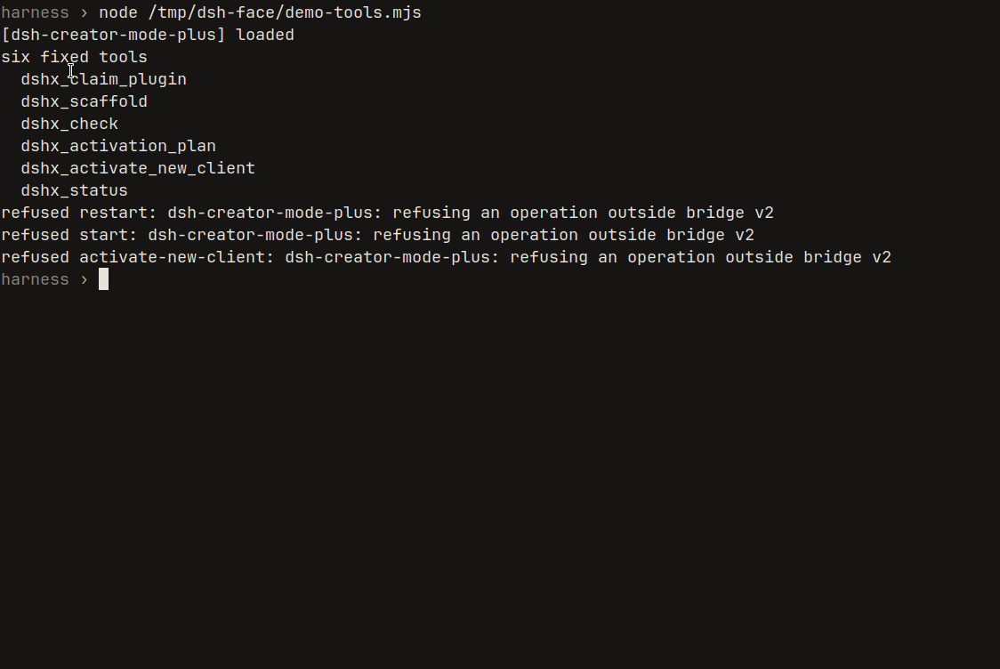

# Creator Mode+

[中文](README.md)

Pick Creator Mode+ in a normal DeepSeek Harness WebUI session. Six fixed tools scaffold, check, and mount a file-backed plugin. Anything outside that list stops. The session does not get Host start, stop, or restart, and it does not get a raw command through the bridge.

This does not replace official Creator Mode. It does not patch Harness core. Unofficial.


In the official mode list, Creator Mode+ sits under Creator mode. The Chinese line is from the user preset.


After you pick it, a new session uses the six fixed tools.


## Install

Do this outside an agent session, from your Harness checkout:

```sh
cd /path/to/deepseek-harness
git clone https://github.com/aa2246740/dsh-creator-mode-plus.git tools/dsh-creator-mode-plus

# A profile dependency is a manifest change. It applies on the next Host boot.
pnpm dsh plugin --profile web add link:./tools/dsh-creator-mode-plus

# Writes a user preset. Leaves the shipped Standard and Creator presets alone.
node tools/dsh-creator-mode-plus/scripts/install.mjs --harness "$PWD"
```

Restart the Web Host once from outside the session, because the profile changed. Open the official WebUI, pick Creator Mode+, and start a new session or a still-blank one.

This wants DSH `dsh-v0.1.0-rc.8` and [DSHX](https://github.com/aa2246740/dsh-external-plugin-devkit) `>=0.6.2 <0.7.0`. A mismatch stops before anything is mutated.

Migrating from the old bundled row, and later upgrades, live in the [Bridge v2 contract](docs/bridge-contract.md).


## The six tools

| Tool | What it does |
|---|---|
| `dshx_status` | Read the supervisor and Host. No process change. |
| `dshx_claim_plugin` | Give this session exclusive ownership of one plugin. |
| `dshx_scaffold` | Create the project in the session workspace. Never overwrites. |
| `dshx_check` | Static checks. A pass only proves the source built. |
| `dshx_activation_plan` | Say whether this change needs a reload or a restart. |
| `dshx_activate_new_client` | Mount a new client in a fixed order. No browser reload. No DSH restart. |



## Fail closed

A second install does not overwrite. Start, restart, and a garbage port are refused.


How Guardian quarantines, restarts once, and hands the incident back to the same session is in the contract. Not here.

## Development

```sh
npm test
npm run check
```

## License

MIT. DeepSeek Harness and DSHX are separate projects with their own licenses.
