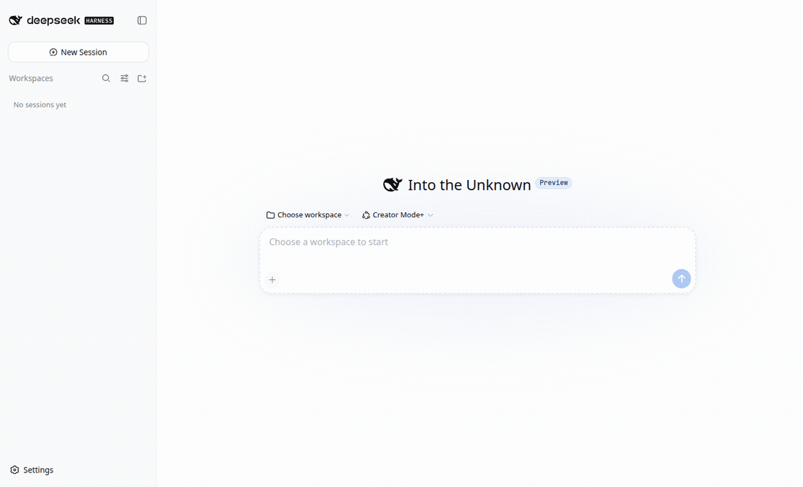
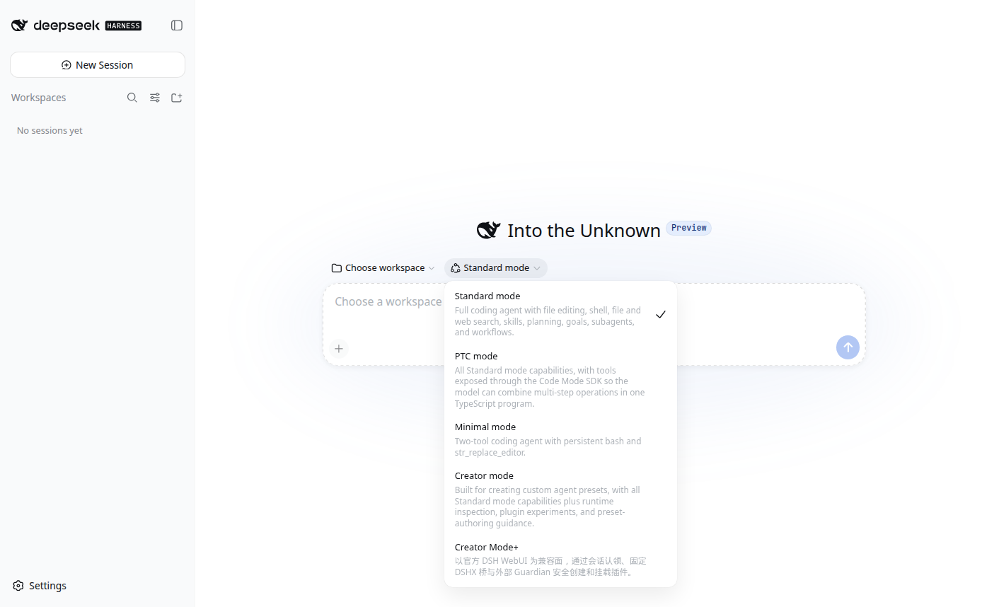
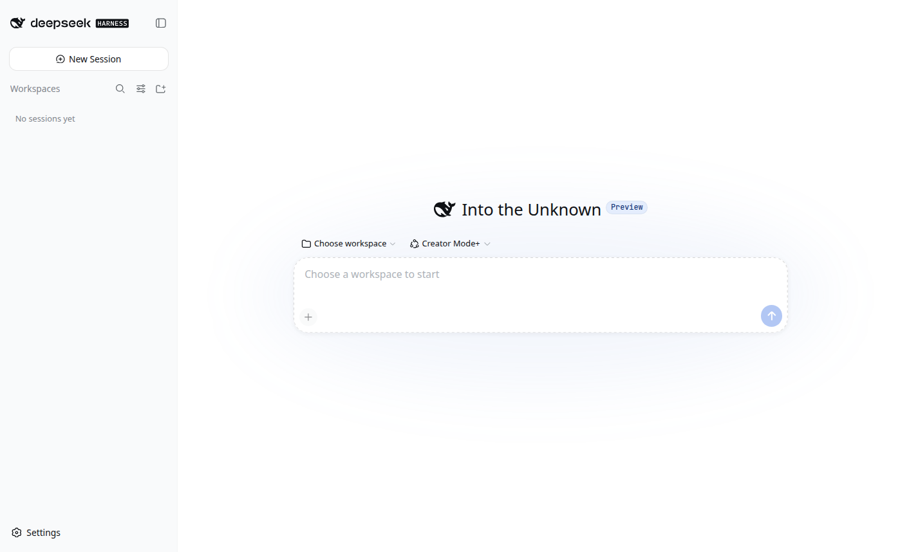
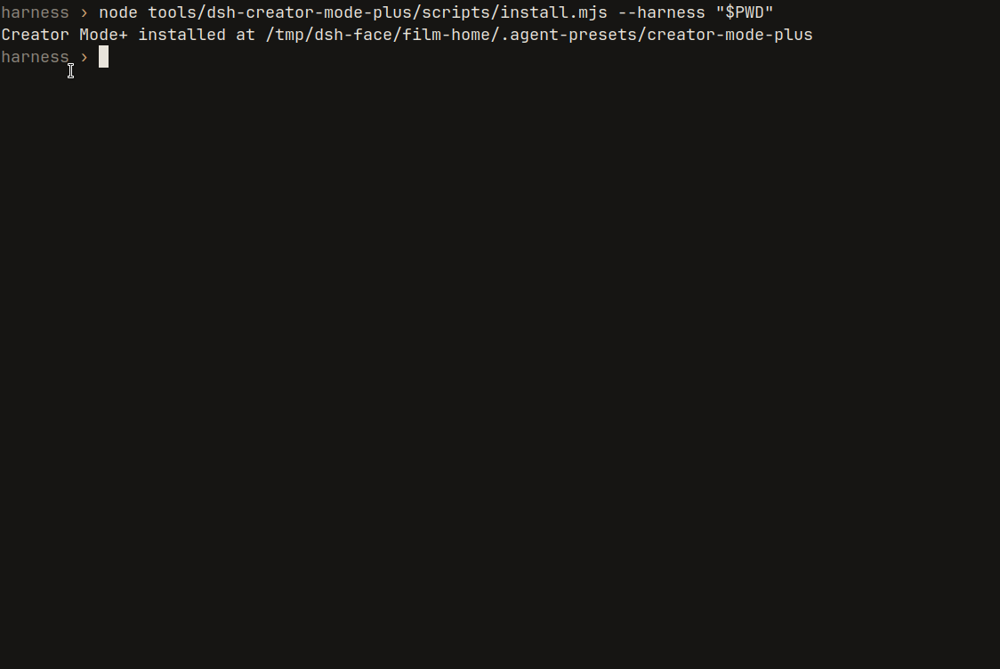
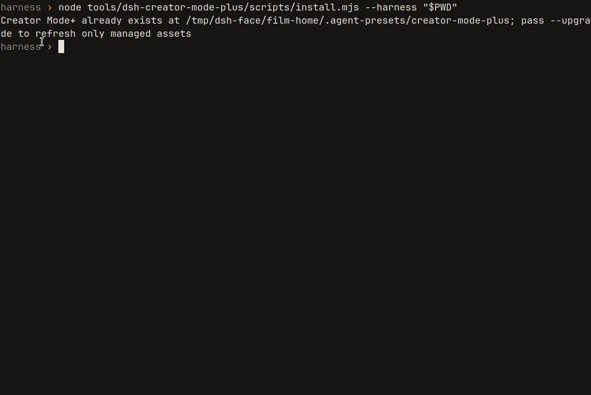

# Creator Mode+

[English](README.en.md)

在 DeepSeek Harness 的普通 Web 会话里选 Creator Mode+，就能用七个固定工具把一个文件化插件搭起来、检查、挂载，也能按安全顺序卸载。0.3.1 对齐 DSHX v0.7.2：会话认领、工作区 scaffold、安全卸载、七分支激活、主动完整性隔离、外部 Guardian 和 Harness Update Assistant 的权限边界都进入同一份 fail-closed 合同。过不了的操作直接停。

不替代官方创造模式。不改 Harness 核心。非官方。



官方模式列表里，Creator Mode+ 排在创造模式下面。那段中文来自用户 preset。



选中之后，新会话走这七个固定工具。



## 安装

在 Agent 会话外面做。进你的 Harness 仓库：

```sh
cd /path/to/deepseek-harness
git clone https://github.com/aa2246740/dsh-creator-mode-plus.git tools/dsh-creator-mode-plus

# profile 依赖是 manifest 变更，下次 Host 启动才生效
pnpm dsh plugin --profile web add link:./tools/dsh-creator-mode-plus

# 只写用户 preset，不动随仓库带的 Standard / Creator
node tools/dsh-creator-mode-plus/scripts/install.mjs --harness "$PWD"
```

因为加了 profile 依赖，先在会话外面把 Web Host 重启一次。然后打开官方 WebUI，选 Creator Mode+，开一个新会话，或者还是空白的那个。

兼容线覆盖 DSH `dsh-v0.1.0-rc.8` 的 Creator/Guardian 合同和当前 `dsh-v0.1.1-rc.2`。必须使用 [DSHX](https://github.com/aa2246740/dsh-external-plugin-devkit) `>=0.7.2 <0.8.0`。0.7.2 在 0.7.1 的 RC8/RC2 boot-manifest 兼容上新增安全卸载和 Guardian 主动完整性隔离；安装器会检查 Creator、Guardian、卸载、激活矩阵、managed-shell gate、Harness Update Assistant 和对应知识合同，缺一项就在写 preset 前停止。

新浏览器插件的固定顺序是：scaffold 后先实现、构建并通过 `dshx_check`，再运行 `dshx_activation_plan` 和同 PID 激活。未构建的 scaffold 不再被错误地要求先通过 activation plan。

从旧的 bundled 版本迁过来、以后升级，看 [Bridge v2 合同](docs/bridge-contract.md)；本次完整对齐矩阵见 [DSHX v0.7 alignment](docs/dshx-v0.7-alignment.md)。



## 七个工具

| 工具 | 做什么 |
|---|---|
| `dshx_status` | 读 supervisor 和 Host，不动进程 |
| `dshx_claim_plugin` | 这个会话独占一个插件 |
| `dshx_scaffold` | 在会话工作区建项目，不覆盖已有的 |
| `dshx_check` | 静态检查。过了只证明源码能建起来 |
| `dshx_activation_plan` | 分类这次改动要不要重载或重启 |
| `dshx_activate_new_client` | 按固定顺序挂新 client。不刷新浏览器，不重启 DSH |
| `dshx_remove_plugin` | 先让当前 Host 脱载，再清 profile；只断开链接，保留源码 |

整插件删除只走 `dshx_remove_plugin`。组件内部普通文件仍可正常删除；直接拆插件根、`my-plugins` 链接或 active profile 会被桥拒绝。RC8 若删了 dependency 却遗留该插件的 `node_modules` symlink，事务会从 durable quarantine 续跑，只在目标精确属于本 claim 时解绑；目录或越界目标失败关闭。即使旧 Agent 绕过桥，Guardian 也会在 profile link 消失、Host 尚健康时先隔离 stale row，避免下一次冷启动炸掉。

## 过不了就停

已经装着再跑安装器，它不会覆盖。模型想 start、restart，或者把端口写成乱的，桥直接拒。



Guardian 怎么隔离、怎么只重启一次、怎么把事故交回原来的会话，都写在合同里。这里不展开。

## Harness 更新边界

DSHX v0.7 新增 `update plan → prepare → verify → apply` 和精确 `rollback`，但 Creator Mode+ 的第七个工具只负责安全卸载，不把 Harness 更新变成第八个工具。会话内只允许通过 managed shell 读取 `update plan`；`prepare`、`verify`、`apply`、`rollback` 和 Host 进程控制全部交给外部 DSHX supervisor。候选验证通过、本机应用完成、真实运行时接受、正式激活是四个不同状态。

## 从 0.2.x 升级

在 Agent 会话外执行：

```sh
cd /path/to/deepseek-harness/tools/dsh-creator-mode-plus
git pull --ff-only
node scripts/install.mjs --harness /path/to/deepseek-harness --upgrade
npm run verify:dshx -- --harness /path/to/deepseek-harness
```

0.3.1 增加了 server bridge 的安全卸载工具和 bash guard，因此已经运行 0.3.0 的 Web Host 也需要由外部 supervisor 受控重启一次，才能加载新保护。这个重启属于 `server` 分支；普通 preset 发现和以后只更新 skill、且 composition 字节不变的升级不需要重启。

## 开发

```sh
npm test
npm run check
npm run verify:dshx -- --harness /absolute/path/to/deepseek-harness
npm run verify:harness-install -- --harness /absolute/path/to/deepseek-harness
/absolute/path/to/deepseek-harness/tools/dshx/skill/dshx/scripts/dshx.sh check "$PWD" --harness /absolute/path/to/deepseek-harness
npm pack --dry-run
```

## License

MIT。DeepSeek Harness 和 DSHX 是别的项目，各有各的许可证。
